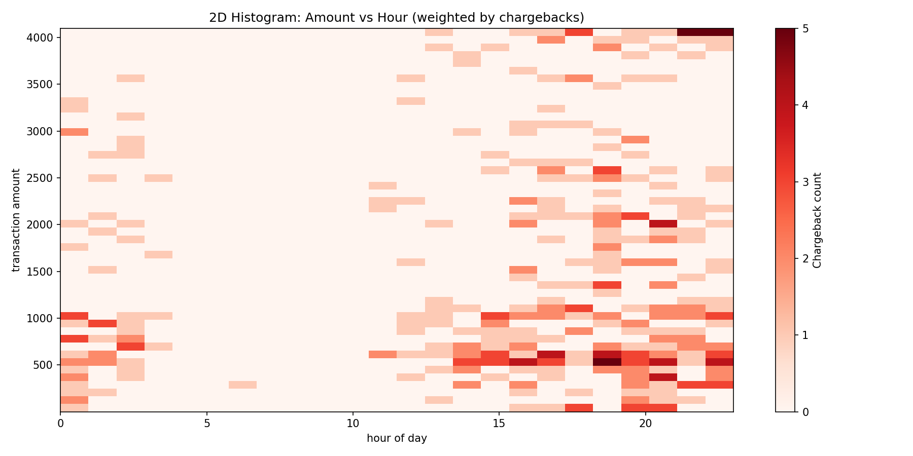
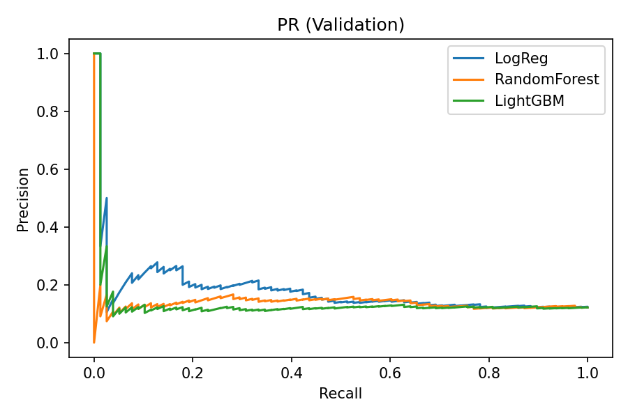

## Fraud Risk Analysis - Technical Case

This repository contains my solution for the **recruitment challenge**.  
The task is to analyze transactional data, detect suspicious behaviors, and propose an anti-fraud strategy that balances security, customer experience, and system performance.

---

### Problem Statement
A dataset was sent, with *card-not-present* (CNP, likely cellphone) transactions with 7 transaction fields.

Example payload in `json`:
{
  "transaction_id": 2342357,
  "merchant_id": 29744,
  "user_id": 97051,
  "card_number": "434505******9116",
  "transaction_date": "2019-11-31T23:16:32.812632",
  "transaction_amount": 373,
  "device_id": 285475,
  "has_cbk": false
}

**The goal is to:**
- Identify suspicious patterns in the data.
- Propose relevant external data sources that would improve fraud detection.
- Recommend fraud prevention measures to reduce chargebacks.
- Design a conceptual/technical solution (rules, ML model, or hybrid).
- Present findings with clear reasoning, tables, and charts.

**Tech Stack**
- *Python 3.10+*
- `pandas` for data wrangling
- `numpy` for numerical computations
- `matplotlib` for visualization
- `sklearn` for model training  

### Exploratory Data Analysis

**Dataset Overview**
- **Source:** provided spreadsheet with 3199 records
- **Fields:** `merchant_id`, `user_id`, `card_number`, `device_id`, `transaction_amount`, `has_cbk` 

**The first step was cleaning and validating the dataset:**
- *Null handling:* ~26% of device_id values missing, flagged for exploration.
- *Transaction dates:* parsed and validated.
- *Uniqueness:* ensured transaction_id is unique.
- *Amounts:* checked for non-positive and extreme outliers.
- *Chargeback prevalence:* baseline fraud rate calculated from has_cbk. 

**Fraud Indicators Considered** 
- Multiple rapid attempts by the same user_id or device_id.
- High-value transactions above dynamic thresholds.
- Cards shared across many users (possible mule accounts).
- Users with past chargebacks (has_cbk=True), implying higher risk going forward. 

**Suspicious Patterns Identified** 
- High-value transactions after business hours
- Users or devices linked an above-average number of cards or merchants
- Unusual spikes in transaction volume/amount per user/device

  

#### Other Data to Include
- The dataset is limited to a single month. Expanding tha sample would probably enhance the analysis.
- Geolocation / IP address  
- Velocity checks (transactions per minute/hour)
- Merchant risk history (MCC, industry category)
- Behavioral biometrics (typing speed, navigation)
- External blacklists (cards, devices, emails)  

#### Preventive Measures
- Velocity & amount thresholds
- Stronger device fingerprinting
- Real-time anomaly scoring
- Merchant education on fraud signals

#### Solution Design
The system's response shouldn't be limited to denying transactions. It should also account for false positives and use deterrent strategies to prevent fraud, such as delay suspicious approvals or displaying warning messages. Fraud often depends on multiple factors, including whether the fraudster feels they're being monitored.  
*Hybrid approach (rules + scoring model):* 
Rules engine: 
- *Reject too many attempts in short period.*
- *Reject transactions above amount threshold per time window.*
- *Reject if user or merchant has previous chargeback.*
Scoring model (*prototype*): 
- *Logistic Regression trained on features: transaction frequency, transaction amount percentile, past CBK history.*
- *Three fraud detection models were tested: Logistic Regression (LogReg), Random Forest, and LightGBM.*
- *Logistic Regression was chosen, since it performed "less worse" on the tests.*
- *It should produce a risk score trigger approval, manual review or rejection.*  
The models did not perform well. The chosen one (Logistic Regression) catches about half of frauds, but most of its alerts are false alarms. This highlights the need for better features, more data, or alternative modeling approaches.  

  

Architecture sketch: 
- *Data ingestion (CSV / API)*
> *Sanity checks + feature engineering* 
> *Rule engine evaluation* 
> *ML model scoring* 
> *Decision output (approval, suspicion delay, manual review, rejection).*   

---

#### 2.1 Explain briefly the money flow, the information flow and the role of the main players in the payment industry.
**Money and information flows:**
- First, the consumer pays a merchant with a card or another device that sends raw data, including a single-use token and cryptographed identifiers. 
- Then, the acquirer routes and enforce compliance of the payment. For example, the merchant's credit card machine provider, digital wallet provider or PIX-style solution, manage the payment through tokenization. 
- Lastly, the issuer processes the information. In other words, the consumer's bank, approves or declines, funds go from issuer to acquirer and merchant receives the payment, after fees. 
Transaction details (amount, card number, merchant ID, risk signals) move in parallel with the transaction authorization through obligations shapen by regulators, such as the central bank. 
Information travels instantly (seconds), while actual clearing and settlement of funds flows in the opposite direction and can take more time, even days. 

**Main players roles:**
- *Cardholder (consumer):* initiates payment.
- *Merchant:* accepts payment.
- *Acquirer (merchant's bank):* processes transactions for merchants.
- *Issuer (consumer's bank):* provides the card and approves or declines transaction.
- *Card network:* routes data and enforces rules.
Intermediaries (sub-acquirers, payment gateways, payment system providers): provide technical layers to smaller merchants.

#### 2.2. Explain the main differences between acquirer, sub-acquirer and payment gateway, and how the flow explained in the previous question changes for these players.
- *Acquirer:* Bank or licensed entity directly connected to card networks, settling transactions with merchants.
- *Sub-acquirer:* Works under an acquirer, aggregating many small merchants who can't contract directly. Provides simplified onboarding and receives money from the acquirer before paying merchants.
- *Payment gateway:* Information bridge that securely transmits payment data from merchant systems to the acquirer. It does not handle funds.
Some PSPs, Payment Service Providers, combine payment pateway and sub-acquirer, like PagSeguro.

**Impact on flows:**
- *With an acquirer:* direct merchant–bank relationship, money flows straight from issuer to acquirer, and finally to the merchant.
- *With a sub-acquirer:* money flow gains one extra layer between the acquirer and merchant, adding delays and fees, assuming merchant risk.
- *With a gateway:* information flow changes, being routed through the gateway for security and connectivity, with no money step added.

#### 2.3. Explain what chargebacks are, how they differ from a cancellation and what is their connection with fraud in the acquiring world.
Cancellations are initiated by the merchant or customer before the sale settles. Funds often never leave or are quickly reversed.
Chargebacks are compliance mechanisms enforced by networks triggered by formal disputes from the cardholder to the issuer. Funds might be forcibly pulled back from the merchant's account, often with fees and penalties.
Many chargebacks are due to fraud, for example, events of stolen cards, identity theft, or "friendly fraud" where a customer falsely claims non-recognition.
Still, most chargebacks are considered legitimate, due to lack of product delivery, or a "friend fraud"due to lack of recognition of recurring billing or family usage of the card, to illustrate some cases.
High chargeback ratios expose merchants and acquirers to fines and increased monitoring by card networks.

#### 2.4. What is an anti-fraud and how an acquirer uses it.
Anti-fraud is a set of tools, rules and models, often machine-learning based, that assess transaction risk in real time by checking patterns on IP, device, velocity, mismatched addresses, abnormal amounts, etc.
**How acquirers use it:**
To apply adaptive rules that block, challenge, or approve, based on transaction risk scores, screening prior to sending them to issuers.
Sometimes offered as a service to merchants, protecting them and keeping chargeback ratios low, but also filtering out high-risk merchants upfront.
This not only protects the merchant's funds, but prevent them being flagged by issuer, blocking services and receiving customer complaints.
Not only the anti-fraud prevents leakage, but should aware of balancing it false positives, which wrongly block fair sales.

---

## Visual Resources
- [Looker Dashboard](https://lookerstudio.google.com/reporting/fc4fc4a3-58ec-4778-8eae-42b129eaf3a0)
- [Slideshow Presentation](https://docs.google.com/presentation/d/10ktH4tIaCiCk7qEKRSGA3gh01VC6oRdpZSpJMdxbkWE/edit?usp=sharing)
